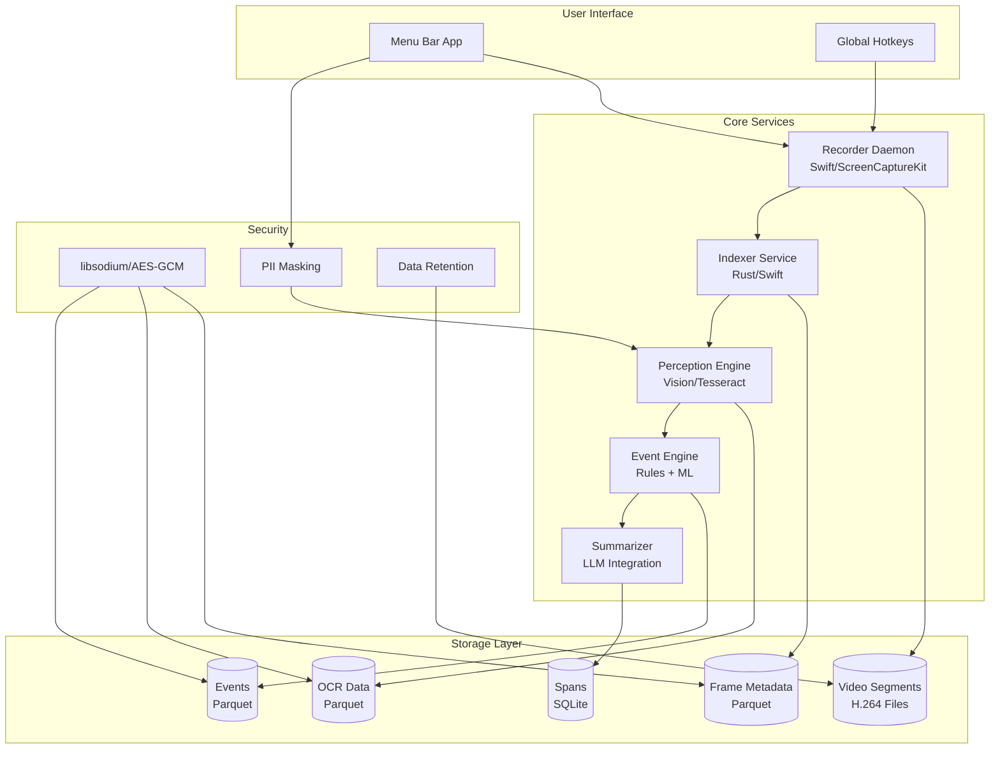

# Design Document

## Overview

The Always-On AI Companion system is architected as a collection of loosely-coupled services that work together to provide continuous screen recording, intelligent analysis, and knowledge extraction. The system uses native macOS technologies for optimal performance and stability, with a focus on local-first processing and strong privacy controls.

The architecture follows a pipeline approach: Recorder → Indexer → Perception → Event Engine → Summarizer → Knowledge Store, with a Control Surface providing user interaction capabilities.

## Architecture

### High-Level System Architecture



### Service Communication

Services communicate through:
- **File-based queues**: New video segments trigger indexer processing
- **Shared storage**: Parquet and SQLite databases provide data exchange
- **IPC**: Menu bar app communicates with recorder daemon via XPC
- **Configuration files**: JSON-based configuration for all services

## Components and Interfaces

### 1. Recorder Daemon (Swift)

**Purpose**: Continuous multi-monitor screen capture using ScreenCaptureKit

**Key Components**:
- `ScreenCaptureManager`: Manages ScreenCaptureKit sessions for each display
- `VideoEncoder`: H.264 encoding via VideoToolbox with yuv420p format
- `SegmentManager`: Creates 2-minute segments with faststart enabled
- `RecoveryManager`: Handles crashes and automatic restart
- `LaunchAgentManager`: Manages system startup integration

**Interfaces**:
```swift
protocol ScreenCaptureManagerProtocol {
    func startCapture(displays: [CGDirectDisplayID]) async throws
    func stopCapture() async
    func pauseCapture() async
    func resumeCapture() async
    var isRecording: Bool { get }
    var currentSegment: VideoSegment? { get }
}

protocol VideoEncoderProtocol {
    func encode(frame: CVPixelBuffer, timestamp: CMTime) async throws
    func finishSegment() async throws -> URL
    var compressionSettings: [String: Any] { get set }
}
```

**Configuration**:
- Target bitrate: 2-4 Mbps per display
- Frame rate: 30 FPS
- Segment duration: 120 seconds
- Recovery timeout: 5 seconds

### 2. Indexer Service (Rust)

**Purpose**: Extract keyframes and detect scene changes for efficient processing

**Key Components**:
- `KeyframeExtractor`: Extracts frames at 1-2 FPS using FFmpeg bindings
- `SceneDetector`: SSIM and pHash-based scene change detection
- `MetadataCollector`: Gathers app/window information via macOS APIs
- `ParquetWriter`: Efficient columnar storage for frame metadata

**Interfaces**:
```rust
trait KeyframeExtractor {
    async fn extract_keyframes(&self, video_path: &Path) -> Result<Vec<Keyframe>>;
    fn set_extraction_rate(&mut self, fps: f32);
}

trait SceneDetector {
    fn detect_scene_changes(&self, frames: &[Keyframe]) -> Vec<SceneChange>;
    fn calculate_phash(&self, frame: &Keyframe) -> u64;
    fn calculate_ssim(&self, frame1: &Keyframe, frame2: &Keyframe) -> f32;
}
```

**Data Schema** (frames.parquet):
```
ts_ns: i64           // Nanosecond timestamp
monitor_id: i32      // Display identifier
segment_id: string   // Video segment reference
path: string         // Frame image path
phash16: i64         // 16-bit perceptual hash
entropy: f32         // Image entropy measure
app_name: string     // Active application
win_title: string    // Window title
```

### 3. Perception Engine (Swift/Python)

**Purpose**: Extract text and visual elements from keyframes

**Key Components**:
- `VisionOCRProcessor`: Primary OCR using Apple Vision framework
- `TesseractFallback`: Backup OCR for Vision failures
- `ImagePreprocessor`: Binarization, deskew, ROI cropping
- `ROIDetector`: Identifies text regions and UI elements

**Interfaces**:
```swift
protocol OCRProcessor {
    func extractText(from image: CGImage) async throws -> [OCRResult]
    func preprocessImage(_ image: CGImage) -> CGImage
    var confidence: Float { get }
}

struct OCRResult {
    let text: String
    let boundingBox: CGRect
    let confidence: Float
    let language: String
}
```

**Data Schema** (ocr.parquet):
```
frame_id: string     // Reference to frame
roi: struct          // Bounding box coordinates
text: string         // Extracted text
lang: string         // Detected language
confidence: f32      // OCR confidence score
```

### 4. Event Engine (Python/Rust)

**Purpose**: Detect meaningful interactions and changes from OCR deltas

**Key Components**:
- `DeltaAnalyzer`: Compares OCR results between frames
- `EventClassifier`: Categorizes events (field changes, navigation, clicks)
- `CursorTracker`: Tracks mouse movements and clicks
- `ErrorDetector`: Identifies error messages and modals

**Event Types**:
- `FieldChange`: Text field value modifications
- `Navigation`: Window/tab/page changes
- `Click`: Mouse click events with context
- `Error`: Error messages and modal dialogs
- `AppSwitch`: Application focus changes

**Data Schema** (events.parquet):
```
ts_ns: i64           // Event timestamp
type: string         // Event type
target: string       // UI element identifier
value_from: string   // Previous value
value_to: string     // New value
confidence: f32      // Detection confidence
evidence_frames: list<string>  // Supporting frame IDs
```

### 5. Summarizer (Python)

**Purpose**: Generate human-readable summaries and reports

**Key Components**:
- `ActivitySummarizer`: Creates narrative summaries of work sessions
- `ReportGenerator`: Produces Markdown, CSV, and JSON outputs
- `PlaybookCreator`: Generates action sequences for colleagues
- `TemplateEngine`: Customizable report templates

**Output Formats**:
- **Markdown**: Narrative reports with embedded tables and timelines
- **CSV**: Structured data for analysis and integration
- **JSON**: Machine-readable format for API consumption
- **Playbooks**: Step-by-step action sequences

### 6. Knowledge Store

**Purpose**: Persistent storage with encryption and retention policies

**Storage Systems**:
- **Video Files**: H.264 segments in organized directory structure
- **Parquet Files**: Columnar storage for frames, OCR, and events
- **SQLite**: Relational storage for spans and summaries
- **Configuration**: JSON files for system settings

**Encryption Strategy**:
- **At-rest**: AES-GCM encryption for all stored data
- **Key management**: libsodium-based key derivation
- **Per-user keys**: Unique encryption keys per user account

**Retention Policies**:
- **Raw video**: 14-30 days (configurable)
- **Frame metadata**: 90 days
- **OCR data**: 90 days
- **Events**: 1 year
- **Summaries**: Permanent

### 7. Control Surface (Swift)

**Purpose**: User interface and system control

**Key Components**:
- `MenuBarController`: System tray interface
- `SettingsManager`: Configuration management
- `StatusMonitor`: System health and performance monitoring
- `PrivacyController`: Privacy mode and pause functionality

**Features**:
- Real-time recording status
- Performance metrics display
- One-click pause/resume
- Privacy mode toggle
- Settings configuration
- Data export tools

## Data Models

### Core Data Structures

```swift
struct VideoSegment {
    let id: UUID
    let startTime: Date
    let endTime: Date
    let filePath: URL
    let displayID: CGDirectDisplayID
    let fileSize: Int64
}

struct Keyframe {
    let id: UUID
    let segmentID: UUID
    let timestamp: TimeInterval
    let imagePath: URL
    let phash: UInt64
    let entropy: Float
    let appContext: AppContext
}

struct AppContext {
    let bundleID: String
    let appName: String
    let windowTitle: String
    let processID: pid_t
}

struct Event {
    let id: UUID
    let timestamp: Date
    let type: EventType
    let target: String
    let valueBefore: String?
    let valueAfter: String?
    let confidence: Float
    let evidenceFrames: [UUID]
}
```

### Database Schemas

**spans.sqlite**:
```sql
CREATE TABLE spans (
    span_id TEXT PRIMARY KEY,
    kind TEXT NOT NULL,
    t_start INTEGER NOT NULL,
    t_end INTEGER NOT NULL,
    title TEXT NOT NULL,
    summary_md TEXT,
    tags TEXT, -- JSON array
    created_at INTEGER DEFAULT (strftime('%s', 'now'))
);

CREATE INDEX idx_spans_time ON spans(t_start, t_end);
CREATE INDEX idx_spans_kind ON spans(kind);
```

## Error Handling

### Recovery Strategies

1. **Recorder Failures**:
   - Automatic restart within 5 seconds
   - Graceful degradation to single-monitor capture
   - Fallback to lower quality settings if needed

2. **Processing Failures**:
   - Queue failed segments for retry
   - Skip corrupted frames with logging
   - Continue processing remaining data

3. **Storage Failures**:
   - Automatic cleanup of corrupted files
   - Fallback to alternative storage locations
   - Data integrity verification

### Monitoring and Alerting

- Performance metrics collection
- Error rate monitoring
- Storage space alerts
- System health checks

## Testing Strategy

### Unit Testing

- **Recorder**: Mock ScreenCaptureKit for testing capture logic
- **Indexer**: Test keyframe extraction with sample videos
- **Perception**: Validate OCR accuracy with known text images
- **Event Engine**: Test event detection with synthetic data
- **Storage**: Verify encryption and data integrity

### Integration Testing

- **End-to-end pipeline**: Record → Index → Analyze → Store
- **Multi-monitor scenarios**: Test with various display configurations
- **Performance testing**: Validate CPU and memory usage under load
- **Recovery testing**: Simulate failures and verify recovery

### Performance Testing

- **Load testing**: 3x 1440p@30fps sustained capture
- **Memory profiling**: Ensure stable memory usage over time
- **Storage benchmarks**: Verify I/O performance requirements
- **Latency testing**: Measure processing delays

### Privacy and Security Testing

- **Encryption validation**: Verify data protection at rest
- **PII detection**: Test masking of sensitive information
- **Access control**: Validate permission requirements
- **Data retention**: Verify automatic cleanup policies

## Deployment and Configuration

### Installation Process

1. **System Requirements Check**: macOS 14+, hardware capabilities
2. **Permission Requests**: Screen recording, accessibility access
3. **LaunchAgent Installation**: Background daemon setup
4. **Initial Configuration**: Display selection, quality settings
5. **Security Setup**: Encryption key generation, privacy settings

### Configuration Management

- **JSON-based configuration**: Human-readable settings files
- **Environment-specific configs**: Development, testing, production
- **Runtime configuration**: Dynamic settings updates
- **Migration support**: Automatic config upgrades

### Monitoring and Maintenance

- **Health checks**: Automated system status verification
- **Log management**: Structured logging with rotation
- **Update mechanism**: Automatic component updates
- **Backup and restore**: Configuration and data backup tools