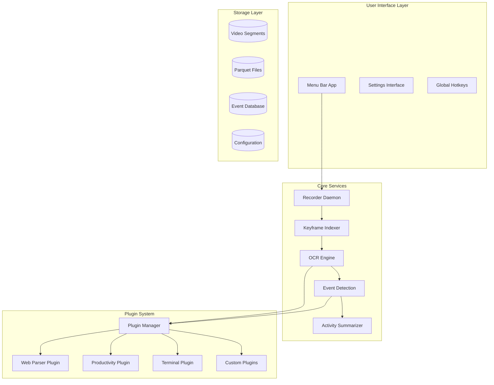

# Always-On AI Companion - Developer Guide

## Table of Contents

1. [Architecture Overview](#architecture-overview)
2. [Development Environment Setup](#development-environment-setup)
3. [Plugin Development](#plugin-development)
4. [System Extension](#system-extension)
5. [API Reference](#api-reference)
6. [Testing Guidelines](#testing-guidelines)
7. [Contributing](#contributing)
8. [Advanced Topics](#advanced-topics)

## Architecture Overview

### System Components

The Always-On AI Companion follows a modular architecture with clear separation of concerns:



### Technology Stack

- **Swift**: Core system components, UI, and native macOS integration
- **Rust**: High-performance video processing and data analysis
- **Python**: Machine learning components and advanced analytics
- **SwiftUI**: User interface components
- **ScreenCaptureKit**: Native macOS screen recording
- **Vision Framework**: Apple's OCR and image analysis
- **SQLite**: Structured data storage
- **Apache Parquet**: Columnar data storage

### Data Flow

1. **Capture**: ScreenCaptureKit captures display content
2. **Encode**: VideoToolbox encodes H.264 segments
3. **Index**: Rust service extracts keyframes and metadata
4. **Analyze**: OCR engines extract text and visual elements
5. **Detect**: Event detection identifies meaningful interactions
6. **Process**: Plugins provide application-specific parsing
7. **Summarize**: AI generates human-readable summaries
8. **Store**: Encrypted storage with configurable retention

## Development Environment Setup

### Prerequisites

- **Xcode 15.0+**: Required for Swift development
- **Rust 1.70+**: For video processing components
- **Python 3.9+**: For ML and analytics components
- **macOS 14.0+**: Development and testing platform

### Initial Setup

1. **Clone Repository**:
   ```bash
   git clone https://github.com/your-org/AlwaysOnAICompanion.git
   cd AlwaysOnAICompanion
   ```

2. **Install Dependencies**:
   ```bash
   # Install Rust dependencies
   cd keyframe-indexer
   cargo build
   
   # Install Python dependencies
   pip install -r requirements.txt
   
   # Install Swift dependencies (handled by Xcode)
   ```

3. **Configure Development Environment**:
   ```bash
   # Copy development configuration
   cp config/development.json ~/.alwaysonaicompanion/config.json
   
   # Set up development certificates
   ./Scripts/setup-dev-certs.sh
   ```

4. **Build Project**:
   ```bash
   # Build all components
   make build-dev
   
   # Run tests
   make test
   ```

### Development Workflow

1. **Feature Development**:
   - Create feature branch: `git checkout -b feature/your-feature`
   - Implement changes with tests
   - Run full test suite: `make test-all`
   - Submit pull request

2. **Testing**:
   - Unit tests: `make test-unit`
   - Integration tests: `make test-integration`
   - Performance tests: `make test-performance`

3. **Debugging**:
   - Use Xcode debugger for Swift components
   - Use `cargo test` for Rust components
   - Enable debug logging: `export DEBUG=1`

## Plugin Development

### Plugin Architecture

Plugins extend the system's ability to parse and understand application-specific content. The plugin system provides:

- **Sandboxed Execution**: Plugins run in isolated environments
- **Standardized Interface**: Common API for all plugins
- **Configuration Management**: Per-plugin settings and preferences
- **Lifecycle Management**: Automatic loading, unloading, and updates

### Creating a Plugin

#### 1. Plugin Structure

```
MyPlugin/
├── plugin.json          # Plugin manifest
├── src/
│   ├── parser.swift     # Main plugin logic
│   ├── config.swift     # Configuration handling
│   └── tests/           # Plugin tests
├── resources/           # Plugin resources
└── README.md           # Plugin documentation
```

#### 2. Plugin Manifest

Create `plugin.json`:

```json
{
  "name": "MyCustomPlugin",
  "version": "1.0.0",
  "description": "Custom parsing for MyApp",
  "author": "Your Name",
  "license": "MIT",
  "compatibility": {
    "minSystemVersion": "1.0.0",
    "maxSystemVersion": "2.0.0"
  },
  "entryPoint": "src/parser.swift",
  "permissions": [
    "ocr-access",
    "event-generation"
  ],
  "configuration": {
    "schema": "config-schema.json",
    "defaults": "default-config.json"
  },
  "triggers": {
    "applications": ["com.mycompany.myapp"],
    "windowTitles": ["MyApp - *"],
    "urlPatterns": ["https://myapp.com/*"]
  }
}
```

#### 3. Plugin Implementation

Implement the plugin interface:

```swift
import Foundation
import AlwaysOnAICompanionSDK

@objc(MyCustomPlugin)
public class MyCustomPlugin: BasePlugin {
    
    public override func initialize(config: PluginConfiguration) throws {
        super.initialize(config: config)
        // Plugin initialization logic
    }
    
    public override func parseOCRResults(_ results: [OCRResult], 
                                       context: ApplicationContext) -> [ParsedElement] {
        var parsedElements: [ParsedElement] = []
        
        for result in results {
            if let element = parseMyAppElement(result, context: context) {
                parsedElements.append(element)
            }
        }
        
        return parsedElements
    }
    
    public override func detectEvents(_ elements: [ParsedElement], 
                                    previousElements: [ParsedElement]) -> [DetectedEvent] {
        var events: [DetectedEvent] = []
        
        // Compare current and previous elements to detect changes
        for element in elements {
            if let previousElement = findPreviousElement(element, in: previousElements) {
                if let event = detectChange(from: previousElement, to: element) {
                    events.append(event)
                }
            }
        }
        
        return events
    }
    
    private func parseMyAppElement(_ ocrResult: OCRResult, 
                                 context: ApplicationContext) -> ParsedElement? {
        // Application-specific parsing logic
        guard context.bundleID == "com.mycompany.myapp" else { return nil }
        
        // Example: Parse form fields
        if ocrResult.text.contains("Field:") {
            let fieldName = extractFieldName(from: ocrResult.text)
            let fieldValue = extractFieldValue(from: ocrResult.text)
            
            return ParsedElement(
                type: .formField,
                identifier: fieldName,
                value: fieldValue,
                boundingBox: ocrResult.boundingBox,
                confidence: ocrResult.confidence
            )
        }
        
        return nil
    }
    
    private func detectChange(from previous: ParsedElement, 
                            to current: ParsedElement) -> DetectedEvent? {
        guard previous.identifier == current.identifier else { return nil }
        guard previous.value != current.value else { return nil }
        
        return DetectedEvent(
            type: .fieldChange,
            target: current.identifier,
            valueBefore: previous.value,
            valueAfter: current.value,
            confidence: min(previous.confidence, current.confidence),
            timestamp: Date()
        )
    }
}
```

#### 4. Plugin Configuration

Define configuration schema in `config-schema.json`:

```json
{
  "$schema": "http://json-schema.org/draft-07/schema#",
  "type": "object",
  "properties": {
    "enabled": {
      "type": "boolean",
      "default": true,
      "description": "Enable/disable the plugin"
    },
    "sensitivity": {
      "type": "number",
      "minimum": 0.0,
      "maximum": 1.0,
      "default": 0.8,
      "description": "Detection sensitivity threshold"
    },
    "fieldMappings": {
      "type": "object",
      "description": "Custom field name mappings",
      "additionalProperties": {
        "type": "string"
      }
    }
  }
}
```

#### 5. Plugin Testing

Create comprehensive tests:

```swift
import XCTest
@testable import MyCustomPlugin

class MyCustomPluginTests: XCTestCase {
    
    var plugin: MyCustomPlugin!
    var mockConfig: PluginConfiguration!
    
    override func setUp() {
        super.setUp()
        mockConfig = PluginConfiguration(/* test config */)
        plugin = MyCustomPlugin()
        try! plugin.initialize(config: mockConfig)
    }
    
    func testParseFormField() {
        let ocrResult = OCRResult(
            text: "Field: Username Value: john.doe",
            boundingBox: CGRect(x: 10, y: 10, width: 200, height: 30),
            confidence: 0.95,
            language: "en"
        )
        
        let context = ApplicationContext(
            bundleID: "com.mycompany.myapp",
            appName: "MyApp",
            windowTitle: "Login Form"
        )
        
        let elements = plugin.parseOCRResults([ocrResult], context: context)
        
        XCTAssertEqual(elements.count, 1)
        XCTAssertEqual(elements[0].type, .formField)
        XCTAssertEqual(elements[0].identifier, "Username")
        XCTAssertEqual(elements[0].value, "john.doe")
    }
    
    func testDetectFieldChange() {
        let previousElement = ParsedElement(
            type: .formField,
            identifier: "Username",
            value: "old.user",
            boundingBox: CGRect(x: 10, y: 10, width: 200, height: 30),
            confidence: 0.9
        )
        
        let currentElement = ParsedElement(
            type: .formField,
            identifier: "Username",
            value: "new.user",
            boundingBox: CGRect(x: 10, y: 10, width: 200, height: 30),
            confidence: 0.9
        )
        
        let events = plugin.detectEvents([currentElement], previousElements: [previousElement])
        
        XCTAssertEqual(events.count, 1)
        XCTAssertEqual(events[0].type, .fieldChange)
        XCTAssertEqual(events[0].target, "Username")
        XCTAssertEqual(events[0].valueBefore, "old.user")
        XCTAssertEqual(events[0].valueAfter, "new.user")
    }
}
```

### Plugin Installation and Distribution

#### 1. Building Plugins

```bash
# Build plugin
cd MyPlugin
swift build -c release

# Create plugin bundle
./Scripts/create-plugin-bundle.sh MyPlugin
```

#### 2. Installing Plugins

```bash
# Install plugin system-wide
sudo cp MyPlugin.bundle /Library/Application\ Support/AlwaysOnAICompanion/Plugins/

# Install plugin for current user
cp MyPlugin.bundle ~/Library/Application\ Support/AlwaysOnAICompanion/Plugins/

# Install via command line
./Scripts/install-plugin.sh MyPlugin.bundle
```

#### 3. Plugin Distribution

- **Direct Distribution**: Share `.bundle` files
- **Plugin Registry**: Submit to official plugin registry
- **GitHub Releases**: Distribute via GitHub releases
- **Package Managers**: Support for Homebrew, etc.

### Advanced Plugin Features

#### 1. Machine Learning Integration

```swift
import CoreML

public class MLEnhancedPlugin: BasePlugin {
    private var model: MLModel?
    
    public override func initialize(config: PluginConfiguration) throws {
        try super.initialize(config: config)
        
        // Load custom ML model
        guard let modelURL = Bundle.main.url(forResource: "MyModel", withExtension: "mlmodelc") else {
            throw PluginError.modelNotFound
        }
        
        self.model = try MLModel(contentsOf: modelURL)
    }
    
    public override func parseOCRResults(_ results: [OCRResult], 
                                       context: ApplicationContext) -> [ParsedElement] {
        // Use ML model for enhanced parsing
        return results.compactMap { result in
            return parseWithML(result, using: model)
        }
    }
}
```

#### 2. Custom Event Types

```swift
public enum CustomEventType: String, CaseIterable {
    case workflowStep = "workflow_step"
    case dataEntry = "data_entry"
    case validation = "validation"
    case submission = "submission"
}

extension DetectedEvent {
    static func workflowStep(step: String, context: String) -> DetectedEvent {
        return DetectedEvent(
            type: .custom(CustomEventType.workflowStep.rawValue),
            target: step,
            metadata: ["context": context],
            timestamp: Date()
        )
    }
}
```

#### 3. Plugin Communication

```swift
public class CommunicatingPlugin: BasePlugin {
    
    public override func processEvent(_ event: DetectedEvent) {
        // Send event to other plugins
        pluginManager.broadcast(event: event, excludingSender: self)
        
        // Request data from other plugins
        if let webData = pluginManager.requestData(from: "WebParserPlugin", 
                                                  query: ["url": event.metadata["url"]]) {
            // Process combined data
            processCombinedData(event: event, webData: webData)
        }
    }
}
```

## System Extension

### Extending Core Components

#### 1. Custom OCR Processors

```swift
import Vision

public class CustomOCRProcessor: OCRProcessor {
    
    public func processImage(_ image: CGImage) async throws -> [OCRResult] {
        // Custom OCR implementation
        let request = VNRecognizeTextRequest()
        request.recognitionLevel = .accurate
        request.usesLanguageCorrection = true
        
        // Add custom preprocessing
        let preprocessedImage = applyCustomPreprocessing(image)
        
        let handler = VNImageRequestHandler(cgImage: preprocessedImage)
        try await handler.perform([request])
        
        return request.results?.compactMap { observation in
            guard let topCandidate = observation.topCandidates(1).first else { return nil }
            
            return OCRResult(
                text: topCandidate.string,
                boundingBox: observation.boundingBox,
                confidence: topCandidate.confidence,
                language: detectLanguage(topCandidate.string)
            )
        } ?? []
    }
    
    private func applyCustomPreprocessing(_ image: CGImage) -> CGImage {
        // Custom image preprocessing logic
        // - Noise reduction
        // - Contrast enhancement
        // - Deskewing
        // - ROI extraction
        return image // Placeholder
    }
}
```

#### 2. Custom Event Detectors

```swift
public class WorkflowEventDetector: EventDetector {
    
    public func detectEvents(from elements: [ParsedElement], 
                           previousElements: [ParsedElement],
                           context: ApplicationContext) -> [DetectedEvent] {
        
        var events: [DetectedEvent] = []
        
        // Detect workflow progression
        if let workflowEvent = detectWorkflowProgression(elements, previousElements) {
            events.append(workflowEvent)
        }
        
        // Detect data validation events
        events.append(contentsOf: detectValidationEvents(elements, context))
        
        // Detect completion events
        if let completionEvent = detectWorkflowCompletion(elements, context) {
            events.append(completionEvent)
        }
        
        return events
    }
    
    private func detectWorkflowProgression(_ current: [ParsedElement], 
                                         _ previous: [ParsedElement]) -> DetectedEvent? {
        // Analyze element changes to detect workflow steps
        let currentSteps = extractWorkflowSteps(from: current)
        let previousSteps = extractWorkflowSteps(from: previous)
        
        if currentSteps.count > previousSteps.count {
            let newStep = currentSteps.last!
            return DetectedEvent(
                type: .workflowProgression,
                target: newStep.identifier,
                metadata: ["step": newStep.name, "progress": "\(currentSteps.count)"],
                timestamp: Date()
            )
        }
        
        return nil
    }
}
```

#### 3. Custom Storage Backends

```swift
public class CloudStorageBackend: StorageBackend {
    
    public func store(_ data: Data, key: String, metadata: [String: Any]) async throws {
        // Implement cloud storage logic
        let encryptedData = try encrypt(data)
        try await uploadToCloud(encryptedData, key: key, metadata: metadata)
    }
    
    public func retrieve(key: String) async throws -> Data {
        let encryptedData = try await downloadFromCloud(key: key)
        return try decrypt(encryptedData)
    }
    
    public func delete(key: String) async throws {
        try await deleteFromCloud(key: key)
    }
    
    private func encrypt(_ data: Data) throws -> Data {
        // Implement encryption
        return data // Placeholder
    }
    
    private func decrypt(_ data: Data) throws -> Data {
        // Implement decryption
        return data // Placeholder
    }
}
```

### Integration Points

#### 1. Menu Bar Extensions

```swift
import SwiftUI

public struct CustomMenuBarView: View {
    @ObservedObject var pluginManager: PluginManager
    
    public var body: some View {
        VStack {
            // Custom menu items
            Button("Custom Action") {
                pluginManager.executeCustomAction()
            }
            
            // Plugin status indicators
            ForEach(pluginManager.activePlugins, id: \.name) { plugin in
                HStack {
                    Circle()
                        .fill(plugin.isHealthy ? Color.green : Color.red)
                        .frame(width: 8, height: 8)
                    Text(plugin.name)
                }
            }
        }
    }
}
```

#### 2. Settings Extensions

```swift
public struct PluginSettingsView: View {
    @ObservedObject var plugin: CustomPlugin
    
    public var body: some View {
        Form {
            Section("Custom Plugin Settings") {
                Toggle("Enable Advanced Features", isOn: $plugin.advancedFeaturesEnabled)
                
                Slider(value: $plugin.sensitivity, in: 0...1) {
                    Text("Sensitivity")
                }
                
                Picker("Processing Mode", selection: $plugin.processingMode) {
                    Text("Fast").tag(ProcessingMode.fast)
                    Text("Accurate").tag(ProcessingMode.accurate)
                    Text("Balanced").tag(ProcessingMode.balanced)
                }
            }
        }
    }
}
```

## API Reference

### Core APIs

#### PluginProtocol

```swift
public protocol PluginProtocol: AnyObject {
    var name: String { get }
    var version: String { get }
    var isEnabled: Bool { get set }
    
    func initialize(config: PluginConfiguration) throws
    func parseOCRResults(_ results: [OCRResult], context: ApplicationContext) -> [ParsedElement]
    func detectEvents(_ elements: [ParsedElement], previousElements: [ParsedElement]) -> [DetectedEvent]
    func processEvent(_ event: DetectedEvent)
    func cleanup()
}
```

#### OCRResult

```swift
public struct OCRResult {
    public let text: String
    public let boundingBox: CGRect
    public let confidence: Float
    public let language: String
    public let timestamp: Date
    
    public init(text: String, boundingBox: CGRect, confidence: Float, language: String) {
        self.text = text
        self.boundingBox = boundingBox
        self.confidence = confidence
        self.language = language
        self.timestamp = Date()
    }
}
```

#### ParsedElement

```swift
public struct ParsedElement {
    public enum ElementType {
        case formField
        case button
        case link
        case text
        case image
        case custom(String)
    }
    
    public let type: ElementType
    public let identifier: String
    public let value: String
    public let boundingBox: CGRect
    public let confidence: Float
    public let metadata: [String: Any]
    
    public init(type: ElementType, identifier: String, value: String, 
                boundingBox: CGRect, confidence: Float, metadata: [String: Any] = [:]) {
        self.type = type
        self.identifier = identifier
        self.value = value
        self.boundingBox = boundingBox
        self.confidence = confidence
        self.metadata = metadata
    }
}
```

#### DetectedEvent

```swift
public struct DetectedEvent {
    public enum EventType {
        case fieldChange
        case navigation
        case click
        case error
        case custom(String)
    }
    
    public let id: UUID
    public let type: EventType
    public let target: String
    public let valueBefore: String?
    public let valueAfter: String?
    public let confidence: Float
    public let timestamp: Date
    public let metadata: [String: Any]
    
    public init(type: EventType, target: String, valueBefore: String? = nil, 
                valueAfter: String? = nil, confidence: Float = 1.0, 
                metadata: [String: Any] = [:]) {
        self.id = UUID()
        self.type = type
        self.target = target
        self.valueBefore = valueBefore
        self.valueAfter = valueAfter
        self.confidence = confidence
        self.timestamp = Date()
        self.metadata = metadata
    }
}
```

### Plugin Manager APIs

#### PluginManager

```swift
public class PluginManager {
    public static let shared = PluginManager()
    
    public func loadPlugin(at path: URL) throws -> Plugin
    public func unloadPlugin(named name: String)
    public func enablePlugin(named name: String)
    public func disablePlugin(named name: String)
    
    public func broadcast(event: DetectedEvent, excludingSender: Plugin? = nil)
    public func requestData(from pluginName: String, query: [String: Any]) -> [String: Any]?
    
    public var loadedPlugins: [Plugin] { get }
    public var enabledPlugins: [Plugin] { get }
}
```

### Configuration APIs

#### PluginConfiguration

```swift
public struct PluginConfiguration {
    public let pluginName: String
    public let settings: [String: Any]
    public let permissions: Set<Permission>
    
    public func getValue<T>(for key: String, type: T.Type) -> T?
    public func setValue<T>(_ value: T, for key: String)
    public func hasPermission(_ permission: Permission) -> Bool
}
```

### Storage APIs

#### DataStore

```swift
public protocol DataStore {
    func store<T: Codable>(_ object: T, key: String) async throws
    func retrieve<T: Codable>(_ type: T.Type, key: String) async throws -> T?
    func delete(key: String) async throws
    func exists(key: String) async -> Bool
}
```

## Testing Guidelines

### Unit Testing

#### Plugin Testing Framework

```swift
import XCTest
@testable import AlwaysOnAICompanionSDK

class PluginTestCase: XCTestCase {
    var plugin: Plugin!
    var mockConfig: PluginConfiguration!
    var mockContext: ApplicationContext!
    
    override func setUp() {
        super.setUp()
        setupMockEnvironment()
    }
    
    func setupMockEnvironment() {
        mockConfig = PluginConfiguration(
            pluginName: "TestPlugin",
            settings: ["enabled": true, "sensitivity": 0.8],
            permissions: [.ocrAccess, .eventGeneration]
        )
        
        mockContext = ApplicationContext(
            bundleID: "com.test.app",
            appName: "Test App",
            windowTitle: "Test Window"
        )
    }
    
    func createMockOCRResult(text: String, confidence: Float = 0.9) -> OCRResult {
        return OCRResult(
            text: text,
            boundingBox: CGRect(x: 0, y: 0, width: 100, height: 20),
            confidence: confidence,
            language: "en"
        )
    }
}
```

#### Test Utilities

```swift
public class PluginTestUtilities {
    
    public static func createTestOCRResults() -> [OCRResult] {
        return [
            OCRResult(text: "Username: john.doe", boundingBox: CGRect(x: 10, y: 10, width: 200, height: 30), confidence: 0.95, language: "en"),
            OCRResult(text: "Password: ********", boundingBox: CGRect(x: 10, y: 50, width: 200, height: 30), confidence: 0.90, language: "en"),
            OCRResult(text: "Login", boundingBox: CGRect(x: 10, y: 90, width: 80, height: 30), confidence: 0.98, language: "en")
        ]
    }
    
    public static func createTestApplicationContext(bundleID: String = "com.test.app") -> ApplicationContext {
        return ApplicationContext(
            bundleID: bundleID,
            appName: "Test Application",
            windowTitle: "Test Window"
        )
    }
    
    public static func assertEventsEqual(_ event1: DetectedEvent, _ event2: DetectedEvent, file: StaticString = #file, line: UInt = #line) {
        XCTAssertEqual(event1.type, event2.type, file: file, line: line)
        XCTAssertEqual(event1.target, event2.target, file: file, line: line)
        XCTAssertEqual(event1.valueBefore, event2.valueBefore, file: file, line: line)
        XCTAssertEqual(event1.valueAfter, event2.valueAfter, file: file, line: line)
    }
}
```

### Integration Testing

#### End-to-End Plugin Testing

```swift
class PluginIntegrationTests: XCTestCase {
    
    func testPluginLifecycle() async throws {
        let pluginManager = PluginManager()
        let pluginURL = Bundle.main.url(forResource: "TestPlugin", withExtension: "bundle")!
        
        // Load plugin
        let plugin = try pluginManager.loadPlugin(at: pluginURL)
        XCTAssertTrue(pluginManager.loadedPlugins.contains { $0.name == plugin.name })
        
        // Enable plugin
        pluginManager.enablePlugin(named: plugin.name)
        XCTAssertTrue(plugin.isEnabled)
        
        // Test plugin functionality
        let ocrResults = PluginTestUtilities.createTestOCRResults()
        let context = PluginTestUtilities.createTestApplicationContext()
        let elements = plugin.parseOCRResults(ocrResults, context: context)
        XCTAssertFalse(elements.isEmpty)
        
        // Disable plugin
        pluginManager.disablePlugin(named: plugin.name)
        XCTAssertFalse(plugin.isEnabled)
        
        // Unload plugin
        pluginManager.unloadPlugin(named: plugin.name)
        XCTAssertFalse(pluginManager.loadedPlugins.contains { $0.name == plugin.name })
    }
}
```

### Performance Testing

#### Plugin Performance Benchmarks

```swift
class PluginPerformanceTests: XCTestCase {
    
    func testOCRProcessingPerformance() {
        let plugin = MyCustomPlugin()
        let ocrResults = Array(repeating: PluginTestUtilities.createTestOCRResults(), count: 100).flatMap { $0 }
        let context = PluginTestUtilities.createTestApplicationContext()
        
        measure {
            let _ = plugin.parseOCRResults(ocrResults, context: context)
        }
    }
    
    func testEventDetectionPerformance() {
        let plugin = MyCustomPlugin()
        let elements = createLargeElementSet(count: 1000)
        let previousElements = createLargeElementSet(count: 1000)
        
        measure {
            let _ = plugin.detectEvents(elements, previousElements: previousElements)
        }
    }
    
    private func createLargeElementSet(count: Int) -> [ParsedElement] {
        return (0..<count).map { index in
            ParsedElement(
                type: .formField,
                identifier: "field_\(index)",
                value: "value_\(index)",
                boundingBox: CGRect(x: 0, y: index * 30, width: 200, height: 30),
                confidence: 0.9
            )
        }
    }
}
```

## Contributing

### Code Style Guidelines

#### Swift Code Style

```swift
// Use clear, descriptive names
class ScreenCaptureManager {
    private let captureSession: ScreenCaptureSession
    private var isRecording: Bool = false
    
    // Document public APIs
    /// Starts screen capture for the specified displays
    /// - Parameter displays: Array of display IDs to capture
    /// - Throws: CaptureError if unable to start capture
    public func startCapture(for displays: [CGDirectDisplayID]) throws {
        guard !isRecording else {
            throw CaptureError.alreadyRecording
        }
        
        // Implementation
    }
}

// Use guard statements for early returns
func processOCRResult(_ result: OCRResult) -> ParsedElement? {
    guard result.confidence > 0.7 else { return nil }
    guard !result.text.isEmpty else { return nil }
    
    return ParsedElement(/* ... */)
}

// Use meaningful error types
enum PluginError: Error {
    case configurationInvalid(String)
    case permissionDenied(Permission)
    case processingFailed(underlying: Error)
}
```

#### Rust Code Style

```rust
// Use descriptive function names and documentation
/// Extracts keyframes from a video segment at the specified frame rate
/// 
/// # Arguments
/// * `video_path` - Path to the video file
/// * `fps` - Target frames per second for extraction
/// 
/// # Returns
/// Vector of extracted keyframes with metadata
pub async fn extract_keyframes(
    video_path: &Path, 
    fps: f32
) -> Result<Vec<Keyframe>, ExtractionError> {
    // Implementation
}

// Use proper error handling
#[derive(Debug, thiserror::Error)]
pub enum ExtractionError {
    #[error("Video file not found: {path}")]
    FileNotFound { path: String },
    
    #[error("Invalid video format: {format}")]
    InvalidFormat { format: String },
    
    #[error("Processing failed: {source}")]
    ProcessingFailed {
        #[from]
        source: std::io::Error,
    },
}
```

### Pull Request Process

1. **Fork and Branch**:
   ```bash
   git fork https://github.com/your-org/AlwaysOnAICompanion.git
   git checkout -b feature/my-new-feature
   ```

2. **Implement Changes**:
   - Follow code style guidelines
   - Add comprehensive tests
   - Update documentation
   - Ensure all tests pass

3. **Submit Pull Request**:
   - Provide clear description of changes
   - Reference related issues
   - Include test results
   - Request appropriate reviewers

4. **Code Review Process**:
   - Address reviewer feedback
   - Update tests as needed
   - Ensure CI passes
   - Maintain clean commit history

### Documentation Standards

- **API Documentation**: Use standard documentation comments
- **README Files**: Include setup, usage, and examples
- **Code Comments**: Explain complex logic and algorithms
- **Change Logs**: Document all user-facing changes

## Advanced Topics

### Custom ML Models

#### Integrating Core ML Models

```swift
import CoreML

public class MLEnhancedOCRProcessor: OCRProcessor {
    private let textDetectionModel: MLModel
    private let textRecognitionModel: MLModel
    
    public init() throws {
        // Load custom trained models
        let detectionURL = Bundle.main.url(forResource: "TextDetection", withExtension: "mlmodelc")!
        let recognitionURL = Bundle.main.url(forResource: "TextRecognition", withExtension: "mlmodelc")!
        
        self.textDetectionModel = try MLModel(contentsOf: detectionURL)
        self.textRecognitionModel = try MLModel(contentsOf: recognitionURL)
    }
    
    public func processImage(_ image: CGImage) async throws -> [OCRResult] {
        // Use custom ML pipeline for enhanced OCR
        let textRegions = try await detectTextRegions(in: image)
        let ocrResults = try await recognizeText(in: textRegions, from: image)
        
        return ocrResults
    }
}
```

### Real-time Processing

#### Stream Processing Architecture

```swift
import Combine

public class RealTimeProcessor {
    private let ocrSubject = PassthroughSubject<CGImage, Never>()
    private let eventSubject = PassthroughSubject<DetectedEvent, Never>()
    private var cancellables = Set<AnyCancellable>()
    
    public init() {
        setupProcessingPipeline()
    }
    
    private func setupProcessingPipeline() {
        // OCR processing pipeline
        ocrSubject
            .debounce(for: .milliseconds(100), scheduler: DispatchQueue.global())
            .flatMap { image in
                self.processOCR(image)
                    .catch { _ in Just([]) }
            }
            .sink { ocrResults in
                self.handleOCRResults(ocrResults)
            }
            .store(in: &cancellables)
        
        // Event processing pipeline
        eventSubject
            .buffer(size: 10, prefetch: .keepFull, whenFull: .dropOldest)
            .sink { events in
                self.processEventBatch(events)
            }
            .store(in: &cancellables)
    }
}
```

### Security Considerations

#### Plugin Sandboxing

```swift
public class PluginSandbox {
    private let containerURL: URL
    private let permissions: Set<Permission>
    
    public func executePlugin(_ plugin: Plugin, with input: PluginInput) throws -> PluginOutput {
        // Create isolated execution environment
        let sandbox = try createSandbox(for: plugin)
        
        // Validate permissions
        try validatePermissions(plugin.requiredPermissions, against: permissions)
        
        // Execute with resource limits
        return try executeWithLimits(plugin, input: input, sandbox: sandbox)
    }
    
    private func createSandbox(for plugin: Plugin) throws -> Sandbox {
        // Implementation of plugin sandboxing
        return Sandbox(containerURL: containerURL, plugin: plugin)
    }
}
```

#### Data Encryption

```swift
import CryptoKit

public class AdvancedEncryption {
    private let key: SymmetricKey
    
    public init() throws {
        // Generate or retrieve encryption key
        self.key = try retrieveOrGenerateKey()
    }
    
    public func encrypt<T: Codable>(_ object: T) throws -> Data {
        let data = try JSONEncoder().encode(object)
        let sealedBox = try AES.GCM.seal(data, using: key)
        return sealedBox.combined!
    }
    
    public func decrypt<T: Codable>(_ data: Data, as type: T.Type) throws -> T {
        let sealedBox = try AES.GCM.SealedBox(combined: data)
        let decryptedData = try AES.GCM.open(sealedBox, using: key)
        return try JSONDecoder().decode(type, from: decryptedData)
    }
}
```

This developer guide provides comprehensive information for extending and customizing the Always-On AI Companion system. For additional support, consult the API documentation or reach out to the development team.